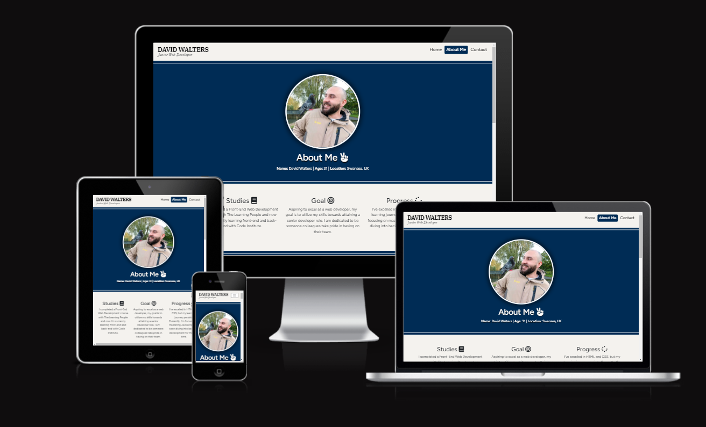

# My Online Portfolio


Visit the deployed site: [My Online Portfolio](https://david-walters.github.io/Milestone-1-Code-Institute/)

I am in the persuit of a career in the world of web developing!

There's no better way to advertise yourself to employers than showcasing your skills in an online portfolio. So, for my first project with Code Institute, I decided to create an online portfolio which will act like a CV and showcase my future work.


## CONTENTS

- [User Experience](#user-experience-ux)

  - [User Stories](#user-stories)

- [Design](#design)

  - [Colour Scheme](#colour-scheme)
  - [Typography](#typography)
  - [Imagery](#imagery)
  - [Wireframes](#wireframes)
  - [Features](#features)
    - [Home Page](#home-page)
    - [About Me Page](#about-me-page)
    - [Contact Page](#contact-page)
    - [Portfolio Page](#portfolio-page)
    - [Future Implementations](#future-implementations)
  - [Accessibility](#accessibility)

- [Technologies Used](#technologies-used)

- [Deployment & Local Development](#deployment-&-local-development)

  - [Deployment](#deployment)
  - [Local Development](#local-development)
    - [How to Fork](#how-to-fork)
    - [How to Clone](#how-to-clone)

- [Testing](#testing)
  - [Solved Bugs](#solved-bugs)
- [Credits](#credits)
  - [Code Used](#code-used)
  - [Personal Overview](#personal-overview)

---


## User Experience (UX)

### User Stories

#### First Time Visitor Goals

- I, as an employer/recruiter, want to see the ability of the applicant in web development.
- I want to know about his experience and qualifications.
- I want to be able to download his CV in PDF format.
- I want the site to be responsive to my device.
- I want the site to be easy to navigate.

#### Returning Visitor Goals

- I want to be able to contact him by sending a message via a form.

#### Frequent Visitor Goals

- I want to see any newly made projects being showcased.
- I want to be able to go to the github repository to see the development stages.

---

## Design

### Colour Scheme

As I wanted the website to be a professional display of my CV and showcase my work, I did not want to have a massive display of colours and have my website be unnecessarily grandiose. So, I decided to only have two theme colours which would appear not too often throughout the site.

In my css file, I have used variables to declare these two theme colours, and then used these throughout the css file. It is a useful convention to use as it allows you to alter the colour throughout the website if you decide to update a colour by changing the colour once in the variable.


- I have used `#f5f5f5` & `#000000` as the primary and secondary colours used for the sites text.
- I have used `#002c55` (theme color 1) for background colours, project cards, contact form, and the active class in nav items.
- I have used `#cf2020` (theme color 2) for the buttons and for the hover effects of nav items.
- I have used `#f4f2ee` for the body as it is easier for the eyes and makes text more legible.

  

### Typography

Google Fonts was used to import the chosen fonts for this site.

- For the the whole website, other than the logo, I have used the google font [Figtree](https://fonts.google.com/specimen/Figtree?query=figtree). Figtree is a clean and friendly geometric sans-serif font family designed by Erik D. Kennedy. It's a versatile typeface that can be used for both text and display purposes, making it a popular choice for UI designers and anyone looking for a modern and approachable font.


- For my name in the logo, I have used the google font [IBM Plex Serif](https://fonts.google.com/?preview.text=Welcome%20To%20My%20Online%20Porfolio%20-%20IBM%20Plex%20Serif&query=IBM+Plex+Serif). IBM Plex Serif is a versatile and contemporary serif typeface that embodies IBM's brand values while offering excellent readability and global support. It's a valuable addition to any designer's font toolkit.


- For the title under my name in the logo, I have used the google font [Milonga](https://fonts.google.com/?preview.text=Welcome%20To%20My%20Online%20Porfolio%20-%20Milonga%20Font&query=Milonga). Milonga is a distinctive and expressive font that infuses text with the energy and artistry of tango culture. It's best used for headlines and display purposes to create eye-catching designs that celebrate creativity and cultural heritage.addition to any designer's font toolkit.


### Imagery

As the website is about presenting myself to employers, I have used an image of myself for the home page (with a welcome message), a reasonably funny image of myself (a pidgeon on my shoulder) in the about me page — to show a sense of humor, and I have used a screenshot of this project for the portfolio card, and the portfolio cards that await a future project to present have a character with a question mark.

### Wireframes

Wireframes were created using Figma.


### Features

The website is comprised of a home page, an about me page, a contact page, and a portfolio page.

All Pages on the website are responsive and have:

- A favicon in the browser tab.

  

- A logo in the top left. This logo also acts as a link back to the home page.
  

- A footer with social media links (Linkedin and Github take the user to my genuine profiles in a new tab. The other two are for show and will take the user to the login page in a new tab.)


#### Home Page

I wanted the home page to be very simple and welcoming — a clear display of the header containing a logo and nav items, image of me, and a welcome message. That's basically what first appears upon the initial screen load.


Scrolling slightly down, A heading titled "Ambition" briefly explaining my desire to be a web developer, which then descends into three smaller headings; 'Discover more about me', 'Interested in reaching out?', and 'Review my projects'. These are each accompanied by a small paragraph respective to the heading to prompt the user to click the red button beneath each paragraph which takes the user to the relevant page.


The home page serves as an introduction to myself with some prompts to navigate through the rest of the project.

#### About Me Page

This page is intended to show information regarding myself to any employers. So, it will basically act like a summerised CV.

I began with a photo of myself, a title for presentational purposes, and I formally displayed my name, age, and current location.



The page is then governed by three sections as the user scrolls down the page;

- Three titles with a paragraph each (Studies, Goal, Progress) explaining my current situation — acting like a cover letter
- History section showing qualifications, education, and work history
- Personal interests showing my hobbies and interests and additional information

At the very bottom of the page there is a heading 'Download my CV' which has an icon beneath it which indicates to click to download the CV.


#### Contact Page

This page is intended for employers to contact me via email whilst keeping my contact details undisclosed.

The user is able to put their first and last name, their email address for me to get back to them, and the message they want to send to me. Additionally, the user must tick the checkbox that is labeled 'not a robot'. All the information the user provides will be sent to me via email after they have gone through a quick verification process to protect me from spam. This is all done using **formspree**.


Formspree acts like the middle-man when sending emails. Once you have made an account on ***https://formspree.io/***, you will be given a code to put into your `<form>` tag which will allow you to receive emails without disclosing your email address. It also saves you from having to do any JavaScript as it is all done for you.

#### Portfolio Page

This is where all my future projects will be displayed.

Beneath a heading of 'Portfolio' and a small sentence below it saying 'This portfolio was established whilst studying Web Development with Code Institute', I have constructed 4 cards that each have an image (which will be a screenshot of the project) and a button with the placeholder of the project's number (ie. Milestone 1).


The button is designed as an interactive element for an accordion feature. When clicked, it triggers an action to expand or collapse a section of content. Specifically:

- Button Functionality: It activates the accordion toggle (using bootstrap's functionality).

- Content Display: Clicking this button reveals or hides information related to the 'Milestone Project #'.

- Link Access: Additionally, within the expanded section, there's a link provided to a GitHub repository associated with 'Milestone Project #'.

On the right side of the button's title is a double arrow pointin down — indicating that there is a dropdown feature when clicked. I have JavaScript specifically for each double arrow to rotate 180 degrees upon each click.


The screenshot image of each project card also increases in brightness when hovered over to indicate a function. It serves as a link which will take the user to the live website, in a new tab, when clicked. The first project is basically this one in particular, so instead it will take the user to the about me page in a new tab.

#### Future Implementations

In future implementations I would like to:

1. Add more projects to the portfolio.
2. Update 'about me' page to state I've learned more skills and other languages.
3. Increase functionality of the website — make it more interactive with more JavaScript.

### Accessibility

I have been mindful during coding to ensure that the website is as accessible friendly as possible. This has been have achieved by:

- Using semantic HTML.
- Using a hover state on all buttons and links on the site to make it clear to the user if they are hovering over a button.
- Choosing a sans serif type font for the site - these fonts are suitable for people with dyslexia.
- Ensuring that there is a sufficient colour contrast throughout the site.

   

For the contact form I used the `label` tag and the attribute `aria label`. This makes it easier for users, especially those with motor impairments or those who might have difficulty clicking on small targets, to interact with form fields.

```html
        <label for="first-name">First Name:
          <input id="first-name" type="text" name="First Name"
          class="d-block" aria-label="First Name" required>
        </label>
      </div>
      <div class="col-lg-6">
        <label for="last-name">Last Name:
          <input id="last-name" type="text" name="Last Name"
          class="d-block" aria-label="Last Name" required>
        </label>
```

---

## Technologies Used

- [**HTML5**](https://developer.mozilla.org/en-US/docs/Web/Guide/HTML/HTML5)
  - The project uses **HTML5** to create the basic elements and content of my website.
- [**CSS3**](https://developer.mozilla.org/en-US/docs/Web/CSS/CSS3)
  - The project uses **CSS3** to add custom styles to the elements and content of my website.
- [**Bootstrap v4.6.2**](https://getbootstrap.com/)
  - The project uses **Bootstrap v4.6.2** to add a responsive grid system, prebuilt components, plugins built on jQuery, and Bootstrap styles to my website, before adding my custom styles.
- [**jQuery**](https://jquery.com)
  - The project uses **jQuery** to simplify DOM manipulation. This is the standard jQuery that is built with Bootstrap components.
- [**JavaScript**](https://www.javascript.com/)
  - The project uses **JavaScript** from Bootstrap which is required to add functionality to some of Bootstrap's components.
- [**Figma Wireframes**](https://www.figma.com/)
  - Using **Figma Wireframes** is very beneficial to guage what you will add and where you will put them on your pages, and it gives you a good visual to see if you missed anything or should add anything.
- [**Font Awesome**](https://fontawesome.com/)
  - The project uses **Font Awesome** for the social media links and various other icons for several headers and titles in my website.
- [**Google Fonts**](https://fonts.google.com/)
  - Having access to **Google Fonts** helped enhance the typography and design of my website by easily integrating and customizing high-quality fonts, thereby improving readability and visual appeal.
- [**Visual Studio Code**](https://code.visualstudio.com/)
  - I've used **Visual Studio Code** as the development environment to write the code for my website.
- [**Git**](https://git-scm.com/)
  - I've used **Git** as a version control system to regularly add and commit changes made to project in Cloud9, before pushing them to GitHub.
- [**GitHub**](https://github.com/)
  - I've used **GitHub** as a remote repository to push and store the committed changes to my project from Git. I've also used GitHub pages to deploy my website in a live environment.
- [**Chrome DevTools**](https://developer.chrome.com/docs/devtools/)
  - I've used **Chrome DevTools** to view my website from different screen sizes and to play around with the HTML and CSS before deciding what code to implement.
- [**Lighthouse**](https://developers.google.com/web/tools/lighthouse)
  - I utilised **Lighthouse** to conduct comprehensive tests on my website, examining performance, accessibility, best practices, and SEO. It generates detailed reports and optimization suggestions to enhance overall website quality and user experience.
- [**W3C Markup Validation**](https://validator.w3.org/)
  - Through using **W3C Markup Validation**, I had conformity to W3C standards for HTML and CSS. I've utilized this tool to verify and rectify HTML issues, ensuring improved cross-browser compatibility and adherence to web standards.
- [**Am I Responsive?**](http://ami.responsivedesign.is/)
  - Through using **Am I Responvive**, I was able to produce the images you have seen in this readme file of the website being displayed on all screen sizes.

---

## Deployment & Local Development

### Deployment

The hosting platform that I've used for my project is GitHub Pages. To deploy my website to GitHub pages, I used the following steps:

1. Press `ctrl+'` in VS Code which opens the integrated terminal in the root directory of the project folder.
2. Initialise Git using the `git init` command.
3. Add all files to the staging area using the `git add .` command.
4. Commit the files using the `git commit -m "First commit"` command.
5. Create a new repository in GitHub called 'Milestone-1'.
6. Copy the code withe the origin that GitHub provides and paste into the terminal window:

   ```
   git remote add origin https://https://github.com/david-walters/Milestone-1-Code-Institute.git

   git push -u origin main

   ```

7. Go into 'Settings' on my repository page in GitHub.
8. Select the 'main branch' option under the 'GitHub Pages' section and then pressed 'save'.
9. Open the provided link to the website in a new tab.

### Local Development

#### How to Fork

To fork the repository:

1. Log in (or sign up) to Github.
2. Go to the repository for this project, [david-walters/Milestone-1-Code-Institute](https://github.com/david-walters/Milestone-1-Code-Institute)
3. Click the Fork button in the top right corner.

#### How to Clone

To clone the repository:

1. Log in (or sign up) to GitHub.
2. Go to the repository for this project, [david-walters/Milestone-1-Code-Institute](https://github.com/david-walters/Milestone-1-Code-Institute)
3. Click on the code button, select whether you would like to clone with HTTPS, SSH or GitHub CLI and copy the link shown.
4. Open the terminal in your code editor and change the current working directory to the location you want to use for the cloned directory.
5. Type 'git clone' into the terminal and then paste the link you copied in step 3. Press enter.

---

## Testing

Please refer to [TESTING.md](TESTING.md) file for all testing carried out.

### Solved Bugs

| No  | Bug                                                                                                                                                                                                                                                                                                                                                                                                        | How I solved the issue                                                                                                                                                                                                                                                                                                                             |
| :-- | :--------------------------------------------------------------------------------------------------------------------------------------------------------------------------------------------------------------------------------------------------------------------------------------------------------------------------------------------------------------------------------------------------------- | :------------------------------------------------------------------------------------------------------------------------------------------------------------------------------------------------------------------------------------------------------------------------------------------------------------------------------------------------- |
| 1   | Bootstrap uses CSS specifically for the nav tags. When I tried adding my logo, it wouldn't go to the position I hoped for, despite me using flexbox and other forms of CSS. It appears my code was conflicting with bootsrtap's code. I decided to put the logo in a seperate div and taking it outsid the nav tag. It then, of course, pushed the nav tag down and appeared on a row above the nav items. | I decided to wrap all the code in a header tag, use position relative on the header tag, and position the logo absolutely to the top left. This brought the nav items back to the top and to the right of the logo and everything aligned perfectly — problem solved.                                                                              |
| 2   | As I was working on the About Me page, I noticed I had unexpected side scroll. It was very difficult to identify what was causing it — despite using dev tools. It takes only one element to overflow which then causes other elements to overflow. I had to use the process of elimination to find out which element was causing it.                                                                      | Using bootstrap's classes `m-0` and `p-0` (to remove all margins and padding), I was able to identify which element was causing the issue. It appeared that my CCS was conflicting with bootstrap's CSS and it forced one div with the class `row` to overflow with its margin. Simply adding `m-0` to that one div in particular fixed the issue. |
| 3   | As I work on my project, I regularly check the code in the Google browser (as one should). Everything was fine, no issues at all. I committed and pushed all my work onto Github and then checked it out live to do a performance check. It turns out, my images were not showing at all.                                                                                                                  | In the file path, I accidentally named the images folder with a capital 'I'. VS code doesn't see this as an issue, but Github is very strict and doesn't recognise the folder's existence. A simple correction of that letter fixed the issue.                                                                                                     |

---

## Credits

### Code Used

I have been using a Bootstrap's libraries and have referred to the Bootstrap website to see how to utilise the libraries.

I have learned how to code a header with nav elements which will collapse into a button which, when pressed, creates a dropdown field revealing the nav items. I also used a standard footer from Bootstrap, and the code for the accordion dropdown box for the portfolio cards is also from Bootstrap.

Even though this code is from the Bootstrap website initially, I had changed it to personalise it for my website.

### Personal Overview

From the beginning to the end of this assignment, it has been an enjoyable process for me. I came across many hurdles that I overcame through perseverance, problem solving, and research — all of which went in my favour.

I have much more to learn, more experience to gain, and I can imagine that I will look back at this website one day and think "What on earth was I thinking" :joy:

It has been a great experience and I'm looking forward to working on my other project assignments which I shall be uploading to my portfolio for people to see.

Thanks for checking this out!

:+1:
