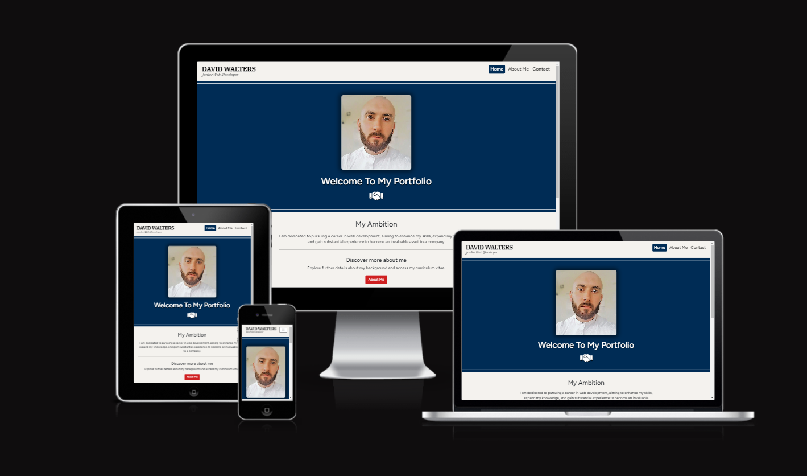

# My Online Portfolio - Testing

Visit the deployed site: [My Online Portfolio](https://david-walters.github.io/Milestone-1-Code-Institute/)

---

## CONTENTS

- [AUTOMATED TESTING](#automated-testing)
  - [W3C Validator](#w3c-validator)
  - [Lighthouse](#lighthouse)
- [MANUAL TESTING](#manual-testing)
  - [Testing User Stories](#testing-user-stories)
  - [Full Testing](#full-testing)

Testing was ongoing throughout the entire build. I utilised Chrome developer tools whilst building to pinpoint and troubleshoot any issues as I went along.

During development I made use of google developer tools to ensure everything was working correctly and to assist with troubleshooting when things were not working as expected.

I have gone through each page using google chrome developer tools & Firefox inspector tool to ensure that each page is responsive on a variety of different screen sizes and devices and to ensure that the keyframes also work on different browsers.

---

## AUTOMATED TESTING

### W3C Validator

[W3C](https://validator.w3.org/) was used to validate the HTML on all pages of the website. It was also used to validate the CSS.

- [index.html](assets/images/testing-images/w3-index.PNG) - Passed/No-errors.
- [about-me.html](assets/images/testing-images/w3-about-me.PNG) - Passed/No-errors
- [contact.html](assets/images/testing-images/w3-contact.PNG) - Passed/No-errors
- [portfolio.html](assets/images/testing-images/w3-portfolio.PNG) - Passed/No-errors

- [style.css](assets/images/testing-images/w3-css.PNG) - Passed/No-errors

---

### Lighthouse

I used Lighthouse within the Chrome Developer Tools to test the performance, accessibility, best practices and SEO of the website.

### Desktop Results

All pages of the site are achieving a score of 100 for accessibility, best practices, and SEO. All pages achieve 98 or more for performance.

### Mobile Results

Each page is achieving a score of 100 for the last three categories. The performance category is achieving a score of 98 for the first three pages and a score of 99 on the 404 & 500 page.

---

## MANUAL TESTING

### Testing User Stories

`First Time Visitors`

| Goals                                                                                     | How are they achieved?                                                                                                                                                                               |
| :---------------------------------------------------------------------------------------- | :--------------------------------------------------------------------------------------------------------------------------------------------------------------------------------------------------- |
| I, as an employer/recruiter, want to see the ability of the applicant in web development. | My porfolio, which showcases my projects which link to the live sites, can be accessed from the home page.                                                                                           |
| I want the site to be responsive to my device.                                            | I have developed the site with Bootstrap's responsive classes — making the site responsive for nearly every device there is.                                                                         |
| I want the site to be easy to navigate.                                                   | Buttons are used throughout the site for navigation, the header with the nav links are always accessible on ebery page along with the footer with the links to social media which open in a new tab. |
| I want to know about his experience and qualifications.                                   | In the about me page, it has all the information regarding work history, experience, qualifications and additional information about myself                                                          |
| I want to be able to download his CV in PDF format.                                       | In the about me page, there is a clear heading at the bottom "Download my CV here" with an icon to press for my CV in PDF format                                                                     |

`Returning Visitors`

| Goals                                                             | How are they achieved?                                                                                             |
| :---------------------------------------------------------------- | :----------------------------------------------------------------------------------------------------------------- |
| I want to be able to contact him by sending a message via a form. | On the contact page, there is a form specifically to send me a message which will be delivered to my email address |

`Frequent Visitors`

| Goals                                                                           | How are they achieved?                                                                                  |
| :------------------------------------------------------------------------------ | :------------------------------------------------------------------------------------------------------ |
| I want to see any newly made projects being showcased.                          | The portfolio page shows exactly that and will be updated when possible                                 |
| I want to be able to go to the github repository to see the development stages. | On each project card in the portfolio page, there is a link to the repository to the respective project |

---

### Full Testing

Full testing was performed on the following devices and more on Google dev tools:

The site was tested using the following browsers:

- Google Chrome
- Microsoft IE
- Firefox

Additional testing was taken by friends and family on a variety of devices and screen sizes. They reported no issues when visiting and navigating.

`Home Page`

| Feature                   | Expected Outcome                                                   | Testing Performed             | Result                                          | Pass/Fail |
| ------------------------- | ------------------------------------------------------------------ | ----------------------------- | ----------------------------------------------- | --------- |
| The site's Logo           | Link should be nullified                                           | Clicked the logo              | Behaves as a nullified link                     | Pass      |
| Nav item - Home           | Link should be nullified                                           | Clicked on the nav item       | Behaves as a nullified link                     | Pass      |
| Nav item - About Me       | Link directs the user to the About Me page                         | Clicked on the nav item       | About me page loads                             | Pass      |
| Nav item - Contact        | Link directs the user to the Contact page                          | Clicked on the nav item       | Contact page loads                              | Pass      |
| Nav items' hover state    | The scale increases and colour changes red                         | Hovered over the nav items    | The scale increases and colour changes red      | Pass      |
| Button - About Me         | Link directs the user to the About Me page                         | Clicked on the button         | About me page loads                             | Pass      |
| Button - Contact Me       | Link directs the user to the Contact Me page                       | Clicked on the button         | Contact page loads                              | Pass      |
| Button - View Projects    | Link directs the user to the Portfolio page                        | Clicked on the button         | Portfolio page loads                            | Pass      |
| Footer icon - Facebook    | Link directs the user to the Facebook login page in a new tab      | Clicked on the icon           | Facebook login page loads in a new tab          | Pass      |
| Footer icon - Twitter(X)  | Link directs the user to the Twitter(X) login page in a new tab    | Clicked on the icon           | Twitter(X) login page loads in a new tab        | Pass      |
| Footer icon - Github      | Link directs the user to my personal Github page in a new tab      | Clicked on the icon           | My personal Github page loads in a new tab      | Pass      |
| Footer icon - Linkedin    | Link directs the user to my personal Linkedin profile in a new tab | Clicked on the icon           | My personal Linkedin profile loads in a new tab | Pass      |
| Footer icons' hover state | The scale increases and colour changes red                         | Hovered over the footer icons | The scale increases and colour changes red      | Pass      |

`About Me Page`

| Feature                        | Expected Outcome                                                   | Testing Performed             | Result                                          | Pass/Fail |
| ------------------------------ | ------------------------------------------------------------------ | ----------------------------- | ----------------------------------------------- | --------- |
| The site's Logo                | Link directs the user to the home page                             | Clicked the logo              | Home page reloads                               | Pass      |
| Nav item - Home                | Link directs the user to the home page                             | Clicked on the nav item       | Home page reloads                               | Pass      |
| Nav item - About Me            | Link should be nullified                                           | Clicked on the nav item       | Behaves as a nullified link                     | Pass      |
| Nav item - Contact             | Link directs the user to the Contact page                          | Clicked on the nav item       | Contact page loads                              | Pass      |
| Nav items hover state          | The scale increases and colour changes red                         | Hovered over the nav items    | The scale increases and colour changes red      | Pass      |
| Download CV icon               | User receives my CV as a PDF in downloads                          | Clicked on the icon           | My CV is downloaded as in PDF format            | Pass      |
| Download CV icon's hover state | The scale increases and colour changes red                         | Hovered over the icon         | The scale increases and colour changes red      | Pass      |
| Footer icon - Facebook         | Link directs the user to the Facebook login page in a new tab      | Clicked on the icon           | Facebook login page loads in a new tab          | Pass      |
| Footer icon - Twitter(X)       | Link directs the user to the Twitter(X) login page in a new tab    | Clicked on the icon           | Twitter(X) login page loads in a new tab        | Pass      |
| Footer icon - Github           | Link directs the user to my personal Github page in a new tab      | Clicked on the icon           | My personal Github page loads in a new tab      | Pass      |
| Footer icon - Linkedin         | Link directs the user to my personal Linkedin profile in a new tab | Clicked on the icon           | My personal Linkedin profile loads in a new tab | Pass      |
| Footer icons' hover state      | The scale increases and colour changes red                         | Hovered over the footer icons | The scale increases and colour changes red      | Pass      |

`Contact Page`

| Feature                           | Expected Outcome                                                   | Testing Performed                                                     | Result                                                                 | Pass/Fail |
| --------------------------------- | ------------------------------------------------------------------ | --------------------------------------------------------------------- | ---------------------------------------------------------------------- | --------- |
| The site's Logo                   | Link directs the user to the home page                             | Clicked the logo                                                      | Home page reloads                                                      | Pass      |
| Nav item - Home                   | Link directs the user to the home page                             | Clicked on the nav item                                               | Home page reloads                                                      | Pass      |
| Nav item - About Me               | Link directs the user to the About Me page                         | Clicked on the nav item                                               | About me page loads                                                    | Pass      |
| Nav item - Contact                | Link should be nullified                                           | Clicked on the nav item                                               | Behaves as a nullified link                                            | Pass      |
| Nav items hover state             | The scale increases and colour changes red                         | Hovered over the nav items                                            | The scale increases and colour changes red                             | Pass      |
| Contact form submission           | I will receive the message sent from the form as an email          | Filled out the form and clicked the send button                       | I received an email which was the message from the form                | Pass      |
| Contact form required fields      | The form will state that a field needs completing before sending   | Clicked the send button with one field empty (repeated on each field) | Form failed to send and stated that the empty field reqires completing | Pass      |
| Contact form success notification | User is notified that the form was submitted successfully          | Completed the form submission                                         | I was notified that the form was submitted successfully                | Pass      |
| Footer icon - Facebook            | Link directs the user to the Facebook login page in a new tab      | Clicked on the icon                                                   | Facebook login page loads in a new tab                                 | Pass      |
| Footer icon - Twitter(X)          | Link directs the user to the Twitter(X) login page in a new tab    | Clicked on the icon                                                   | Twitter(X) login page loads in a new tab                               | Pass      |
| Footer icon - Github              | Link directs the user to my personal Github page in a new tab      | Clicked on the icon                                                   | My personal Github page loads in a new tab                             | Pass      |
| Footer icon - Linkedin            | Link directs the user to my personal Linkedin profile in a new tab | Clicked on the icon                                                   | My personal Linkedin profile loads in a new tab                        | Pass      |
| Footer icons' hover state         | The scale increases and colour changes red                         | Hovered over the footer icons                                         | The scale increases and colour changes red                             | Pass      |

`Portfolio Page`

| Feature                   | Expected Outcome                                                   | Testing Performed                | Result                                                     | Pass/Fail |
| ------------------------- | ------------------------------------------------------------------ | -------------------------------- | ---------------------------------------------------------- | --------- |
| The site's Logo           | Link directs the user to the home page                             | Clicked the logo                 | Home page reloads                                          | Pass      |
| Nav item - Home           | Link directs the user to the home page                             | Clicked on the nav item          | Home page reloads                                          | Pass      |
| Nav item - About Me       | Link directs the user to the About Me page                         | Clicked on the nav item          | About me page loads                                        | Pass      |
| Nav item - Contact        | Link directs the user to the Contact page                          | Clicked on the nav item          | Contact page loads                                         | Pass      |
| Nav items hover state     | The scale increases and colour changes red                         | Hovered over the nav items       | The scale increases and colour changes red                 | Pass      |
| Accordion button #1       | The information of the project is revealed in a dropdown box       | Clicked the button               | A dropdown box appears with the information of the project | Pass      |
| Accordion button #2       | The information of the project is revealed in a dropdown box       | Clicked the button               | A dropdown box appears with the information of the project | Pass      |
| Accordion button #3       | The information of the project is revealed in a dropdown box       | Clicked the button               | A dropdown box appears with the information of the project | Pass      |
| Accordion button #4       | The information of the project is revealed in a dropdown box       | Clicked the button               | A dropdown box appears with the information of the project | Pass      |
| Accordion icon #1         | Icon rotates 180'                                                  | Clicked on the respective button | The icon rotated 180'                                      | Pass      |
| Accordion icon #2         | Icon rotates 180'                                                  | Clicked on the respective button | The icon rotated 180'                                      | Pass      |
| Accordion icon #3         | Icon rotates 180'                                                  | Clicked on the respective button | The icon rotated 180'                                      | Pass      |
| Accordion icon #4         | Icon rotates 180'                                                  | Clicked on the respective button | The icon rotated 180'                                      | Pass      |
| Github repository link #1 | Link directs the user to the project's repository in a new tab     | Clicked on the icon              | A new tab opened with the project's Github repository      | Pass      |
| Footer icon - Facebook    | Link directs the user to the Facebook login page in a new tab      | Clicked on the icon              | Facebook login page loads in a new tab                     | Pass      |
| Footer icon - Twitter(X)  | Link directs the user to the Twitter(X) login page in a new tab    | Clicked on the icon              | Twitter(X) login page loads in a new tab                   | Pass      |
| Footer icon - Github      | Link directs the user to my personal Github page in a new tab      | Clicked on the icon              | My personal Github page loads in a new tab                 | Pass      |
| Footer icon - Linkedin    | Link directs the user to my personal Linkedin profile in a new tab | Clicked on the icon              | My personal Linkedin profile loads in a new tab            | Pass      |
| Footer icons' hover state | The scale increases and colour changes red                         | Hovered over the footer icons    | The scale increases and colour changes red                 | Pass      |
